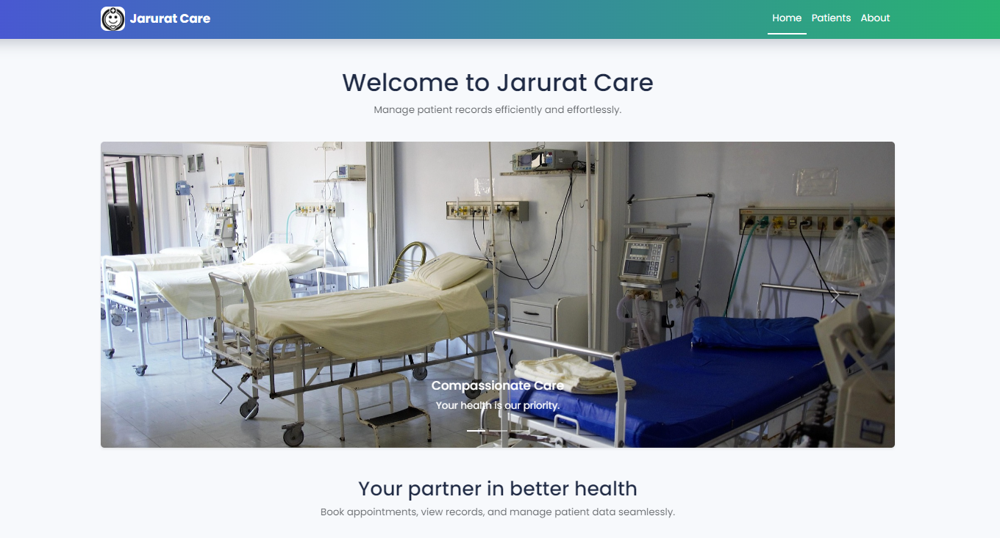
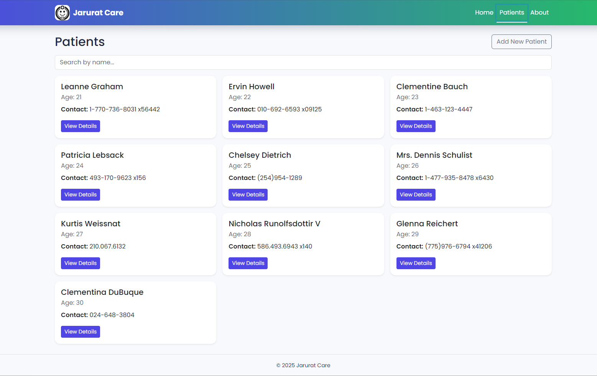
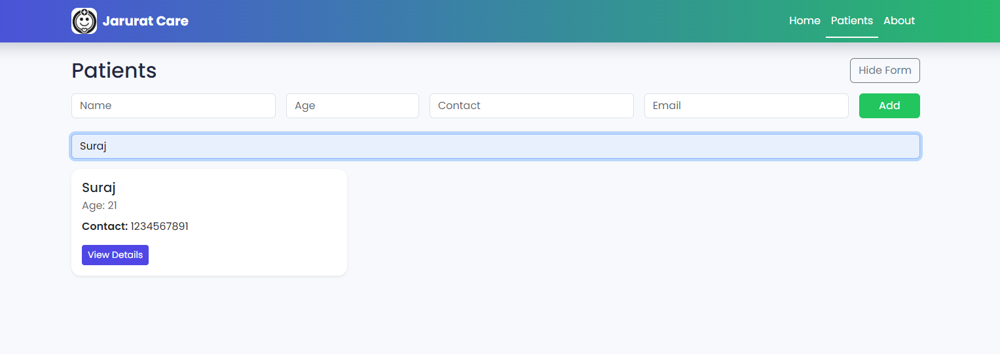
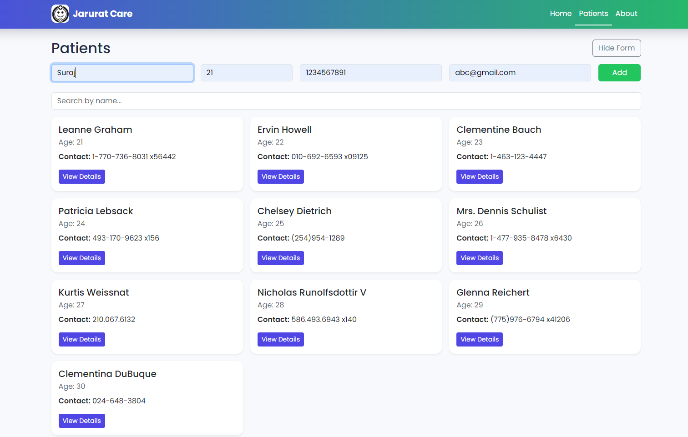
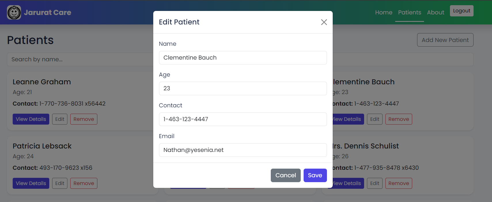
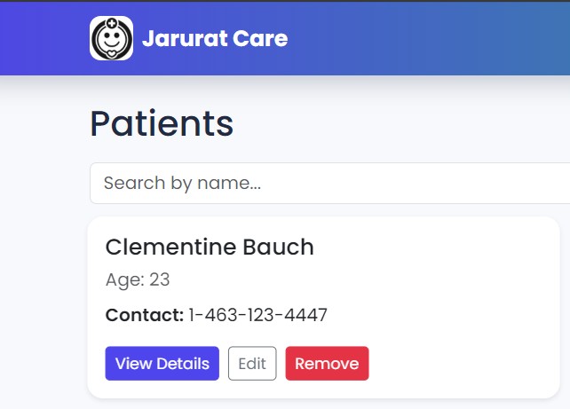
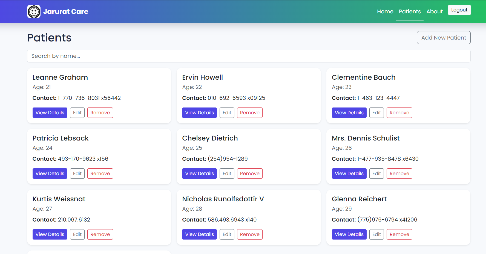
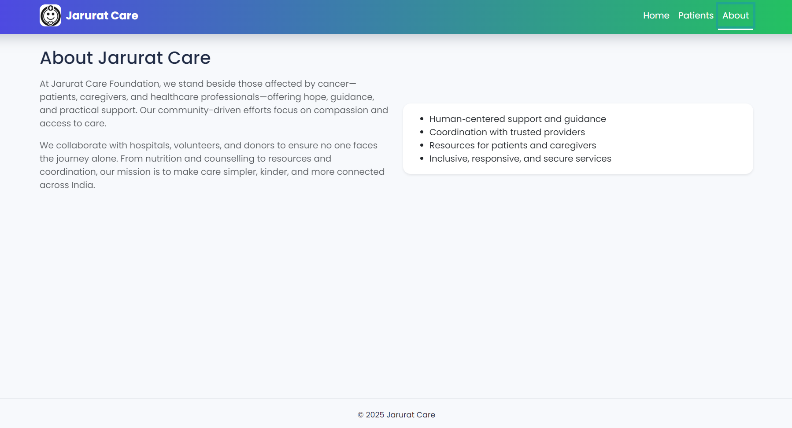

## 🌿 Jarurat Care — Patient Records Dashboard

Modern, responsive React app to browse and manage patient records with search, detail modals, and an optional add‑patient flow. Clean UI, smooth animations, and mobile‑first design.

---

### ✨ Highlights
- 🏠 Animated Home with image carousel and hero text
- 👥 Patients dashboard with search, responsive cards, and details modal
- ➕ Add New Patient (local state) with success toast
- 🔗 URL routing via React Router v6
- 🎨 Polished theme with Poppins font and subtle animations

---

### 🧰 Tech Stack
| Tool | Purpose |
|------|---------|
| React (CRA) | Component-based frontend |
| React Router v6 | Routing and navigation |
| Bootstrap 5 (CDN) | Layout, grid, components |
| Custom CSS | Animations, theming |

---

### 🚀 Quick Start
1) Install dependencies
```
npm install
```
2) Start the dev server
```
npm start
```
3) Open in browser
```
http://localhost:3000
```

---

### 📁 Project Structure
```
jarurat-care-dashboard/
├── public/
│   ├── img/                     # Carousel images (Home page)
│   ├── logo.png                 # Navbar logo
│   ├── favicon.ico
│   ├── logo192.png
│   ├── logo512.png
│   ├── manifest.json
│   └── robots.txt
│
├── src/
│   ├── components/              # Reusable UI components
│   │   ├── AddPatientForm.js
│   │   ├── Header.js
│   │   ├── PatientCard.js
│   │   └── PatientDetailsModal.js
│   │
│   ├── pages/                   # Route pages
│   │   ├── Home.js
│   │   ├── Patients.js
│   │   ├── About.js
│   │   └── AdminLogin.js
│   │
│   ├── context/                 # Global state (React Context)
│   │   └── PatientContext.js
│   │
│   ├── screenshots/             # App preview images for README
│   │   ├── Home.png
│   │   ├── Patients.png
│   │   ├── SearchByName.png
│   │   ├── ViewDetails.png
│   │   ├── NewPatient.png
│   │   ├── EditPatient.png
│   │   ├── RemovePatient.png
│   │   ├── AdminLogin.png
│   │   ├── AdminDashboard.png
│   │   └── About.png
│   │
│   ├── imges/                   # (Optional / Typo folder) consider renaming to 'images'
│   │   ├── logo.png
│   │   └── logo1.svg
│   │
│   ├── App.js                   # Root React component
│   ├── App.css                  # Global styles and theme
│   └── index.js                 # Entry point
│
├── .gitignore                   # Ignored files/folders
├── package.json                 # Dependencies and scripts
├── README.md                    # Project documentation
└── package-lock.json

```

---

### 🔍 Key Features
- Fetch patients from JSONPlaceholder and map to mock patient fields
- Filter by name with instant search
- Card hover lift + shadow animations
- Modal with patient details (contact, email, address)
- Success toast after adding a new patient

---

### 🛠 Customization
- Branding: replace `/logo.png` and assets in `public/img`
- Colors & Fonts: adjust theme in `src/App.css` (Poppins by default)
- Data: update fetch in `src/context/PatientContext.js`

Admin Credentials
- Username: `suraj`
- Password: `suraj123`
- Change credentials in: `src/context/PatientContext.js` (search for `login`)

---

### 🔐 Admin Mode
Admin mode unlocks patient management (add, edit, remove).

- Login route: `/admin`
- After login, visit `/patients` to manage records
- Admin-only UI:
  - Add New Patient button and form
  - Edit button on each patient card (opens modal)
  - Remove button on each patient card
- Logout from the navbar to exit admin mode

Change credentials:
```startLine:endLine:src/context/PatientContext.js
  const login = (username, password) => {
    const ok = username === 'suraj' && password === 'suraj123';
    if (ok) {
      setIsAdmin(true);
      try { localStorage.setItem('jc_is_admin', '1'); } catch {}
      return true;
    }
    return false;
  };
```

Where to manage patients in code:
- Add/Update/Remove functions live in `src/context/PatientContext.js` (`addPatient`, `updatePatient`, `removePatient`)
- Edit modal and list UI are in `src/pages/Patients.js`
- Card actions are in `src/components/PatientCard.js`

---

### 🗺 Routes
- `/` Home
- `/patients` Patients dashboard
- `/about` About Jarurat Care
- `/admin` Admin login

---

### 📌 Notes
- Demo app with mock data only; no real backend writes

---

### 🧭 Roadmap
- Auth (admin)
- Backend integration (Node + DB)
- Analytics and reporting
- Email/notification workflows

Screenshots
| Page                        | Preview                                               |
| --------------------------- | ----------------------------------------------------- |
| 🏠 **Home Page**            |                      |
| 👥 **Patients Dashboard**   |              |
| 🔍 **Search by Name**       |      |
| 📄 **View Patient Details** |        |
| ➕ **Add New Patient**       |          |
| ✏️ **Edit Patient**         |        |
| ❌ **Remove Patient**        |    |
| 🔐 **Admin Login**          |          |
| 🩺 **Admin Dashboard**      |  |
| ℹ️ **About Page**           |                    |


## 👨‍💻 Maintainer
👤 Name: Suraj
📫 Email: Survesuraj38@gmail.com


